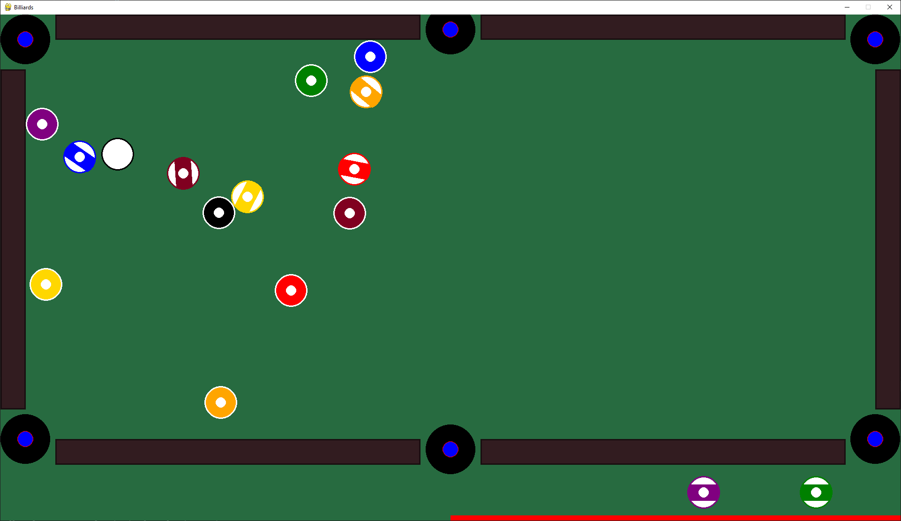

# PoolGenius

Requirements: [pygame](https://pypi.org/project/pygame/) and [Box2D](https://pypi.org/project/Box2D/)

This repository contains a 2D pool engine designed using the **Box2D** library, graphics and visualization support for said engine using **pygame**, and an AI capable of playing pool using the engine. The engine is designed specifically for eight ball pool, however it would be possible to modify it to support other variations of pool.

To run the simulation and see the AI, you can clone the repo and then run src/pool.py

```bash
cd src
python3 pool.py
```

Logs will get created each run and automatically be placed in the logs directory.

A settings file (settings.json) is created in the src directory. Currently it can be used to customize the screen width.

A game in progress:
